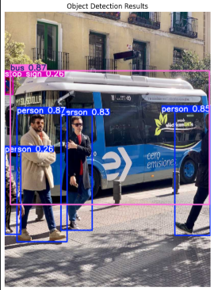
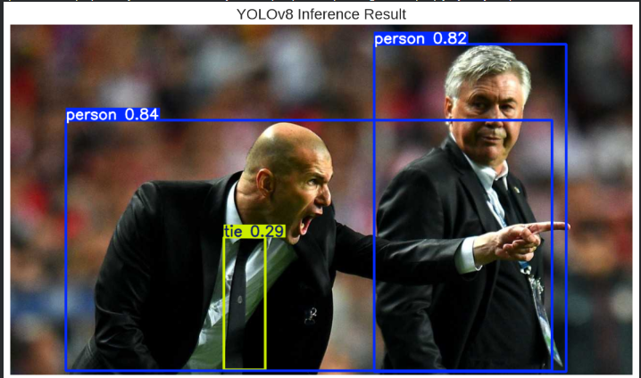
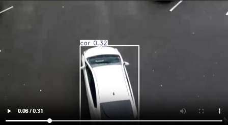
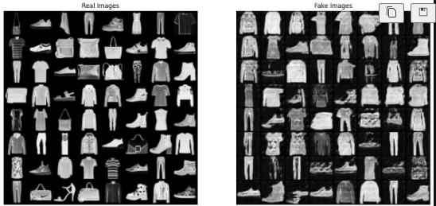

# 🤖 AI Foundations Lab

<div align="center">


**A professional collection of AI/ML fundamentals, implemented from first principles to advanced applied projects.**

[Explore Projects](#-project-showcase) • [Key Features](#-key-features) • [Connect](#-connect-with-me)

---

### ⭐ Star this repo if you find it useful!

</div>

## 📌 Table of Contents

- [📖 About](#-about)
- [✅ Key Features](#-key-features)
- [🚀 Project Showcase](#-project-showcase)
- [🖼️ Showcase Gallery](#-showcase-gallery)
- [🛠️ Technologies](#-technologies)
- [📂 Repository Structure](#-repository-structure)
- [🗺️ Roadmap / Future Work](#-roadmap--future-work)
- [🏁 Getting Started](#-getting-started)
- [📚 Learning Resources](#-learning-resources)
- [🤝 Connect With Me](#-connect-with-me)

---

## 📖 About

This repository serves as a comprehensive laboratory for my journey through the foundations of Artificial Intelligence. Driven by a "Back to Basics" and "First Principles" philosophy, this project documents my transition from academic theory (Stanford/MIT curriculum) to high-fidelity implementation.

Whether it's deriving the gradients for Logistic Regression or architecting a Deep Convolutional GAN, every line of code here is built with rigor, documentation, and a focus on visual performance analytics.

---

## ✅ Key Features

- ✅ **From-scratch implementations**: Neural networks and ML algorithms built using only NumPy.
- ✅ **LaTeX math explanations**: Detailed derivations for cost functions, loss functions, and optimization algorithms.
- ✅ **Clean documented code**: High-quality, professional code with comprehensive comments.
- ✅ **Jupyter visualizations**: Real-time plotting of training curves, decision boundaries, and model outputs.
- ✅ **Real-world projects**: Applied computer vision (YOLOv8) and generative models (GANs).

---

## 🚀 Project Showcase

### 🤖 Machine Learning

Focuses on classical algorithms, statistical learning theory, and supervised/unsupervised learning fundamentals.

- _Includes: Linear/Logistic Regression, K-Means, PCA, Decision Trees._

### 🧠 Deep Learning

Deep dives into multi-layer perceptrons, convolutional neural networks (CNNs), and optimization techniques.

- _Includes: Backpropagation, CNN Architectures, Regularization, Batch Norm._

### 💬 NLP

exploration of sequences and linguistics in AI.

- _Includes: Word Embeddings (Word2Vec), RNNs, LSTMs, and an introduction to Transformers._

### 🎮 Reinforcement Learning

Implementing agents that learn from interaction with their environment.

- _Includes: Q-Learning, SARSA, and Deep Q-Networks (DQN)._

### ⭐ **Applied Projects**

This is where the theory meets the real world. This section highlights high-fidelity implementations of state-of-the-art architectures.

#### [NEW] [Object Detection dengan YOLOv8](./05-applied-projects/Object-Detection-YOLO/)

Complete inference and training pipeline for YOLOv8, including hardware acceleration (CUDA) and performance analytics.

#### [NEW] [Generative Adversarial Networks (GANs)](./05-applied-projects/Generative%20Adversarial%20Networks/)

Implementation of DCGAN for synthetic image generation, exploring adversarial loss and transposed convolutions.

---

## 🖼️ Showcase Gallery

### 🎯 Object Detection (YOLOv8)

> [!NOTE] > **Caption**: Real-time object detection with YOLOv8 - detecting people, vehicles, and objects.

<div align="center">


_Detecting complex scenes with high confidence counts._


_Human and tie detection on sample imagery._


_Real-time video inference frame analysis._

</div>

### 🎨 Generative Art (GANs)

> [!NOTE] > **Caption**: Fashion-MNIST: Real vs Synthetic images generated by GAN.

<div align="center">


_Synthetic fashion items generated after adversarial training._

</div>

---

## 🛠️ Technologies

<div align="center">


</div>

---

## 📂 Repository Structure

```text
ai-foundations-lab/
├── 01-machine-learning/          # Classical ML algorithms
├── 02-deep-learning/             # Neural Networks & CNNs
├── 03-nlp/                       # Natural Language Processing
├── 04-reinforcement-learning/    # RL Agents & Environments
├── 05-applied-projects/          # SOTA Architectures (YOLO, GANs)
│   ├── Generative Adversarial Networks/
│   └── Object-Detection-YOLO/
├── assets/                       # Repository images & media
└── requirements.txt              # Project dependencies
```

---

## 🗺️ Roadmap / Future Work

- [ ] **Vision Transformers (ViT)**: Implementation and comparison with CNNs.
- [ ] **More RL environments**: Training agents on Mujoco/Gymnasium environments.
- [ ] **LLM fine-tuning**: Experiments with LoRA and QLoRA on open-source LLMs.
- [ ] **Web app deployments**: Serving models via FastAPI and Docker.

---

## 🏁 Getting Started

1. **Clone the repository**:

   ```bash
   git clone https://github.com/DaviBonetto/ai-foundations-lab.git
   cd ai-foundations-lab
   ```

2. **Set up the environment**:

   ```bash
   python -m venv .venv
   source .venv/bin/activate  # On Windows: .venv\Scripts\activate
   pip install -r requirements.txt
   ```

3. **Explore the notebooks**:
   Launch Jupyter and dive into any module!

---

## 📚 Learning Resources

This project is inspired by and follows the academic rigor of:

- **Stanford CS229**: Machine Learning
- **Stanford CS231n**: CNNs for Visual Recognition
- **MIT 6.S191**: Introduction to Deep Learning

---

## 🤝 Connect With Me

<div align="center">

[](https://www.linkedin.com/in/davi-bonetto-a4a795350/)
[](https://github.com/DaviBonetto)
[](mailto:davi.bonetto100@gmail.com)

**"The only way to learn a new programming language is by writing programs in it." — Dennis Ritchie**

</div>

---

<div align="center">
Developed with ❤️ by Davi Bonetto
</div>
